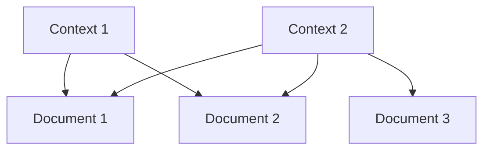
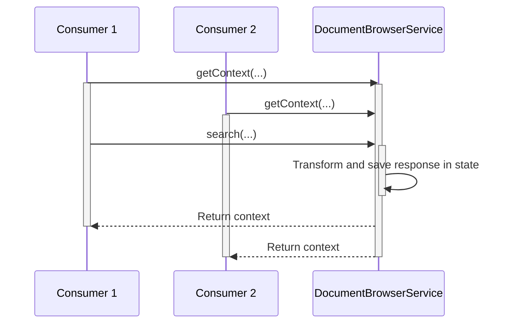
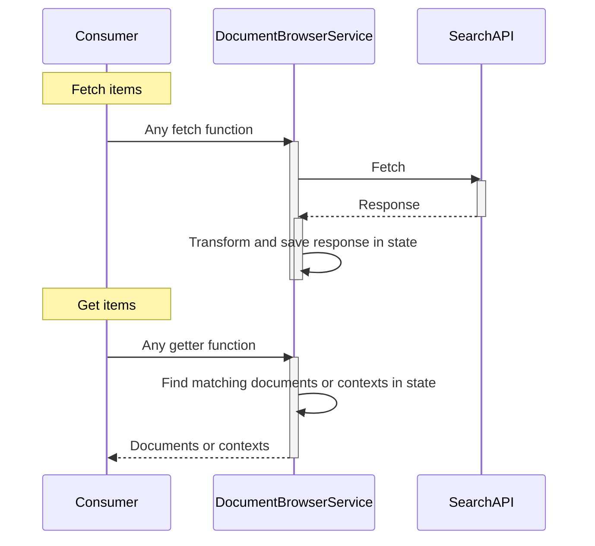

# Product Browser Service

This service is used to fetch items from a datasource and save the items in session storage.
The purpose of the service is:
* To provide a generic way of handling a document store, most importantly: searching, filtering, sorting and pagination.
* To make it easy to change search provider as the service accepts any API that fulfills the ISearchApi.
* Data normalization of documents, ensuring that a document only exists 1 place in memory for any given case. This ensures that if a document is updated, all consumers of the document browser service, will see the update (because they all ref to the exact same piece of memory).

## State
Fetched items are always stored as normalized documents in the state.
If a context key is provided, the remaining information of the search is then also persisted in this context.
This enables further/future operations on a search like pagination, sorting, filtering etc.

Contexts and documents are stored separately in state.

A context has a one to many relationship to document.
They are referenced through the `documents` property of a context. This property contains an array of the document IDs it relates to.
Two different contexts can reference the same documents:



#### Document

A document is a single item returned by the datasource.
There are two types of documents. "Partial" and "Full".

A partial document is a item which only contains a subset of properties available on a full document.

It's faster to fetch partial documents as less properties per item means less data needs to be returned by the datasource. Furthermore the items takes up less space locally.
Hence it makes sense to fetch and partial documents in situations where only the subset of properties are needed.

E.g. on a PLP where properties of a partial document is enough to present a product card.
Whereas a PDP might require all properties of a full document to make the full representation of a product.

You can read which document types are returned by which fetch functions in the [fetch functions section](#fetch-functions).

#### Context

A context contains information about a specific search.
It's a intermediate layer between fetch and get functions.

A context can be referenced globally from multiple locations. This could be to:
- Access documents
- Mutate the context. e.g. its filters.

This means all consumers will see the same information and all will react to mutations made to the context by just one of the consumers.

The sequence diagram below illustrates this in these steps:
1. <ins>Consumer 1</ins> and <ins>Consumer 2</ins> both calls `getContext` with the same `key`.
2. <ins>Consumer 1</ins> thereafter calls `search`. Also with same `key`.
3. The service transforms the response from the datasource and saves this in state a context and documents.
4. Thereafter the new context is returned to both <ins>Consumer 1</ins> and <ins>Consumer 2</ins>.



A context contains the following properties:

| Property | Description |
| --- | ----------- |
| `key` | The context's unique identifier. The context is saved with this key in state and the same key is used to lookup the context with `getContext` or `getContexts`|
| `documents` | An array of documents related to context |
|`query`| used to call `searchAPI.search` |
|`filters`| used to call the search function |
|`id`| `id` returned by the search function |
|`facets`| An array of `TFacet` returned by the search function |
|`sortings`| An array of `TSorting` returned by the search function |
|`activeSorting`| `activeSorting` returned by the search function |
|`activeSearchKeys`| An array of strings. When `search` is called, some of the search payload is converted to JSON and added to this array. <br/> This value is used together with the function `isSearchInContext` to tell a search function has already been called with a specific payload. |
|`hitsPerPage`| Number of items  per page |
|`numberOfHits`| Total number of items available for search |
|`numberOfPages`|Total number of pages available for search |
|`fetchNextPage`| This function will be available when a next page exist. <br/> A next page will exist when `numberOfHits` is greater than `hitsPerPage` and the search is not on the last page. |
|`fetchPrevPage`| This function will be available when a previous page exist. <br/> A previous page will exist when `numberOfHits` is greater than `hitsPerPage` and the search is not on the first page. |

##### Facetting
A facets is a group of filters used to refine a search.
For example, on an index of products, helpful facet might be brand. It allows you to display facets and facet counts so that users can filter results (for example, by brand).

DocumentBrowserService and SearchAPI works closely together to support facetting.

Search functions takes a argument named `includeFacets` which takes an array of facets.
A context contains a property named `facets` which contains an array of facet objects. A object for each facet in the `includeFacets` argument of a search function.

A `facets` object contains the following properties:
| Property | Description |
| --- | ----------- |
| `id` | A unique ID |
| `name` | Name of the facet object |
| `selected` | A boolean value which is true one of it's values are `selected` |
| `values` | An array of facets values. A facet value is described in the table right below |

A facet value contains the following properties:
| Property | Description |
| --- | ----------- |
| `id` | A unique ID |
| `name` | Name of the facet value |
| `filterString` | The string used to "select" the facet value. The facet value is selected by using this value as the `filters` argument when calling a search function |
| `selected` | A boolean value which is true when the `filterString` of the facet value was used as the `filters` argument of a search function |
| `count` | Number of items remaining in the context after the facet value gets selected |

When one facet value is already selected (included in `filters` when calling a search function).
Other facet values are updated to include the already selected facets in their `filterString`.

E.g.
Imagine we have a facet named `brand`.
`brand` has multiple values. Two of which are the brands Salling and Budget.

Salling's filterString is by default `("brand":"Salling")`.
Budget's filterString is by default `("brand":"Budget")`.

Then `search` is called with Sallings filterString:
```ts
search({
  ...
  filters: `("brand":"Salling")`,
})
```

The remaining facets are then updated to include Sallings filterString as Salling is now *Selected*.

Budget's filterString will thereby now be: `("brand":"Salling") OR ("brand":"Budget")`.

###### Facetting example:
```ts
const contextKey = 'SEARCH_CONTEXT';

// Fetch item
documentBrowserService.search({
  contextKey,
  includeFacets: ['brand']
});

// Get fetched context
const offerContext = documentBrowserService.getContext(contextKey);

// Find Salling facets object
const sallingFacet = offerContext.facets.find((facet) => facet.name === 'Salling');

// Filter Salling brand only in search context
documentBrowserService.search({
  contextKey,
  includeFacets: ['brand'],
  filters: sallingFacet.filterString;
});

// When the filterString of a facet is used when calling a search function. The `selected` property of the facet will be true.
const isSallingFacetSelected = sallingFacet.selected
const sallingItems = offerContext.documents;
```

## How to use

#### Instantiate

Instantiate a `DocumentBrowserService` by giving it:

1. A datasource that implements `ISearchAPI`.
(`ISearchAPI` is a model that can be implemented for different backends to be as reusable as possible)
2. A function that tells which property to consider as the identifying (unique) key of the document.

```ts
const documentBrowserService = new DocumentBrowserService(
  algoliaProductSearchAPI,
  (d) => d.id
);
```

#### Usage diagram
Items are fetched and added to state with fetch function. They are looked up with getter function.

A common usage of the service will follow this sequence diagram:


#### Fetch functions

You can fetch items with these function:
`findByIds`, `findByIdFull`, `findByIdsFull`, `search` and `searchByIds`.

`findByIds`, `findByIdFull` and `findByIdsFull` calls their equivalent function on searchApi and merges returned items into existing documents already in state.
`search` and `searchByIds` calls their equivalent function on searchApi with a payload. They create a context from the response and merges this into an existing context with same key, if such already exist in state. Otherwise the new context is added to state. Furthermore it merges items from the response into existing documents already in state.

Partial documents are fetched with `findByIds`.
Full documents are fetched with `findByIdFull`, `findByIdsFull`, `search` and `searchByIds`.

#### Getter functions

These getter functions returns an Observable which emit contexts or documents after items have been fetched with one of the fetch function.

You can get items with these function:
`getDocument`, `getDocuments`, `getContext` and `getContexts`,

## Use cases

### Find single or multiple items by id

You can use `findBy...` functions to find single or multiple items based on their identifier

```ts
const itemId = 'some id';

// Fetch item
documentBrowserService.findByIdFull(itemId);

// Get fetched item
const item = documentBrowserService.getDocument(itemId);
```

### Find items which matches a specific query or filters

You can find items that matches a specific query or filters with the `search` function.
This will save the fetched items in a context.

```ts
const contextKey = 'SEARCH_CONTEXT';

// Fetch item
documentBrowserService.search({
  contextKey,
  query: '*',
  filters: `"isOnOffer":"true":`
});

// Get fetched context
const offerContext = documentBrowserService.getContext(contextKey);

// Items on offer
const itemsOnOffer = offerContext.documents;
```

### Find items with pagination

Contexts include pagination functionality.
When calling `search` you can use the `hitsPerPage` payload parameter to specify how many items each page should contain.

The `search` call will fetch this number of products and add it to the created context. The created context also includes a property named `numberOfHits` which tells the total count of items found for the specific search.

The context contains more pages when `numberOfHits` is greater than `hitsPerPage`.
In this case the context will include `fetchNextPage` and `fetchPrevPage` to fetch pages additional pages in the same context.

Furthermore the context includes a property named `numberOfPages` which tells the total number of pages available.

```ts
const contextKey = 'SEARCH_CONTEXT';

// Fetch item
documentBrowserService.search({
  contextKey,
  hitsPerPage: 10
});

// Get fetched context
const context = documentBrowserService.getContext(contextKey);

// Should contain 10 items as search with a payload where { hitsPerPage: 10 }
const tenItems = context.documents;

// fetch the next page.
context.fetchNextPage();

// Should contain 20 items. 10 from the initial search and another 10 from the fetchNextPage call
const twentyItems = context.documents;
```
